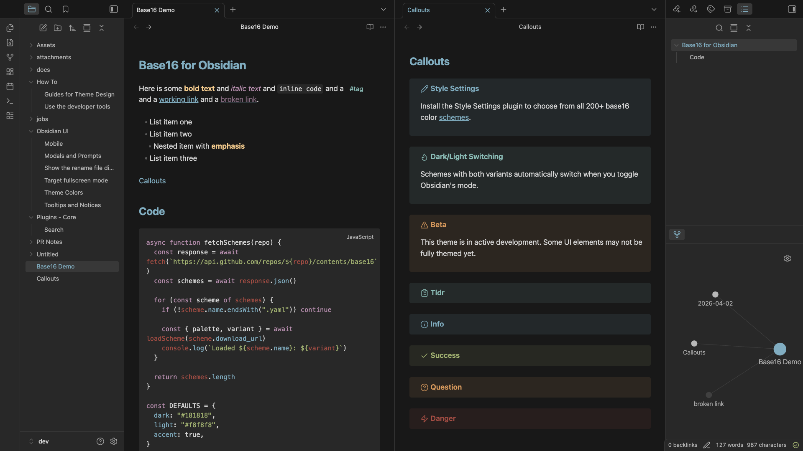

# Base16 for Obsidian

A theme for [Obsidian](https://obsidian.md) built on the [base16](https://github.com/tinted-theming/home) color system. Includes all 200+ base16 schemes with automatic dark/light mode switching.



## Install

### Using BRAT

1. Install the [BRAT](https://github.com/TfTHacker/obsidian42-brat) plugin
2. Open BRAT settings → Add Beta Theme
3. Enter `snelling-a/obsidian-base16-theme`
4. (Optional) Install the [Style Settings](https://github.com/mgmeyers/obsidian-style-settings) plugin to switch between color schemes

### From Community Themes (once approved)

1. Open Obsidian Settings → Appearance → Themes
2. Search for "Base16" and click Install
3. (Optional) Install the [Style Settings](https://github.com/mgmeyers/obsidian-style-settings) plugin to switch between color schemes

## Usage

The theme works out of the box with the Default Dark/Light scheme. To choose from all 200+ schemes, install the [Style Settings](https://github.com/mgmeyers/obsidian-style-settings) plugin and open Settings → Style Settings → Base16. Schemes that have both dark and light variants automatically switch when you toggle Obsidian's dark/light mode.

## Development

```bash
npm install
npm run update    # fetch latest schemes from tinted-theming and rebuild
npm run build     # rebuild theme.css from local schemes
```

## Credits

- Color schemes from [tinted-theming/schemes](https://github.com/tinted-theming/schemes)
- Style Settings integration via [obsidian-style-settings](https://github.com/mgmeyers/obsidian-style-settings)
